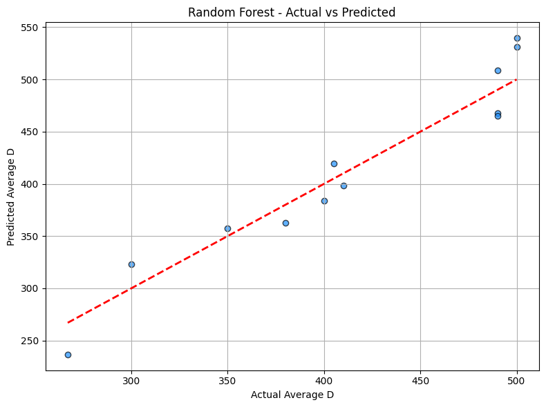
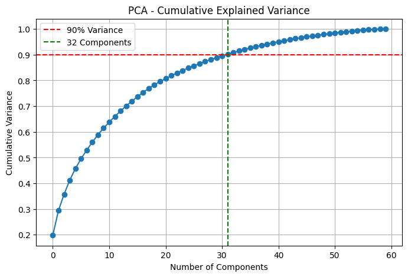

# 🧠 RBL SEM Image Regression (CNN + ML)

[](https://colab.research.google.com/drive/1fLn_mQTZsRlmy201oV3ceCw6sbtd_I71#scrollTo=ROE76NRMNUbg))

> End-to-end machine learning pipeline for SEM image preprocessing, feature extraction with InceptionV3, PCA dimensionality reduction, and regression modeling (Random Forest, XGBoost, Linear Regression) to predict **Average Diameter (D)** from SEM image data.

---

## 👥 Team Members
- **Diki Fernandi** — 20124023  
- **Aulia Defitri Wulandari** — 20224001  
- **Kamilah Nada Maisa** — 20224010  
- **Sudarminto Senlau** — 20224007  

**Supervising Lecturers**:  
Dr. rer. nat. Sparisoma Viridi, S.Si.  
Dr. rer. nat. Mochamad Ikbal Arifyanto, S.Si., M.Sc.

RBL: Machine Learning and AI — June 2025

---

## 📦 Project Structure
```
rbl-sem-image-regression/
├── preprocessing/         # Resize + Binarization (Otsu) using OpenCV
├── embedding/             # Feature extraction with InceptionV3
├── pca/                   # PCA for feature compression
├── regression/            # RF, XGBoost, and Linear Regression models
├── data/                  # Raw, processed, features CSVs
├── examples/              # Sample plots or prediction visuals
├── main_pipeline.ipynb    # Integrated Colab-compatible notebook
├── requirements.txt       # Dependency list
└── README.md
```

---

## ⚙️ Workflow Summary

### 1. **Image Preprocessing**  
📂 `preprocessing/image_binarization.py`
- Resize SEM images to uniform size
- Convert to grayscale & binary (Otsu thresholding)
- Save results to `sem_images_result/`

### 2. **Feature Embedding (CNN)**  
📂 `embedding/inception_embedding.py`
- Load InceptionV3 (without classification head)
- Resize images to 299×299 and extract 2048-dim vectors
- Save results as `features.csv`

### 3. **Dimensionality Reduction (PCA)**  
📂 `pca/pca_features.py`
- Standardize features
- Keep components covering ≥90% variance
- Save to `features_pca.csv`

### 4. **Merge with Target**  
📂 `data/average_d_target.py`
- Manually input `Average_D` values
- Merge with `features_pca.csv`
- Output: `features_target.csv`

### 5. **Regression Modeling**  
📂 `regression/`
- Random Forest (hyperparameter-tuned)
- XGBoost Regressor
- Linear Regression
- Evaluation metrics: **RMSE, R², MAE, MAPE**
- Save models with `joblib`

---

## 📈 Example Results
| Model           | R² Score | RMSE  | MAE   | MAPE  |
|----------------|----------|-------|-------|--------|
| Random Forest  | 0.91     | 23.07 | 21.36 | 5.30%  |
| XGBoost        | 0.94     | 30.37 | 23.56 | 4.99%  |
| Linear Reg.    | 0.98     | 64.86 | 39.06 | 9.31%  |

---

## 🎨 Visualization

### 📊 Prediction vs Actual - Random Forest


### 📊 PCA Variance Plot


---

## 🚀 How to Run (in Colab or local Jupyter)

```python
!pip install -r requirements.txt
from preprocessing.image_binarization import process_sem_folder
from embedding.inception_embedding import extract_features
from pca.pca_features import run_pca
from regression.random_forest import train_random_forest
```

Or run the full pipeline via `main_pipeline.ipynb`

---

## 🔧 Dependencies
```
opencv-python
pandas
numpy
scikit-learn
xgboost
tensorflow
matplotlib
joblib
tqdm
```

Install all via:
```bash
pip install -r requirements.txt
```

---

## 📚 Citation
```
@misc{auliadefitri2025rbl,
  title={SEM Image Preprocessing and Machine Learning Regression},
  author={Aulia Defitri, Diki Fernandi, Kamilah Nada Maisa, Sudarminto Senlau},
  year={2025},
  note={GitHub repository}
}
```

---

## ✉️ Contact
📧 dikifernandi0@gmail.com
📧 auliadefitriw@gmail.com  

---

> Ready to be presented, pushed to GitHub, and cited for research!
> For more visual examples, see the [`examples/`](./examples/) folder.
